# AI Integration Architecture

## Overview

The liblab.ai platform integrates multiple AI models and providers to deliver intelligent code generation, natural language processing, and automated development workflows. The architecture is designed for flexibility, allowing seamless switching between different AI models while maintaining consistent performance and reliability.

## AI Integration Overview

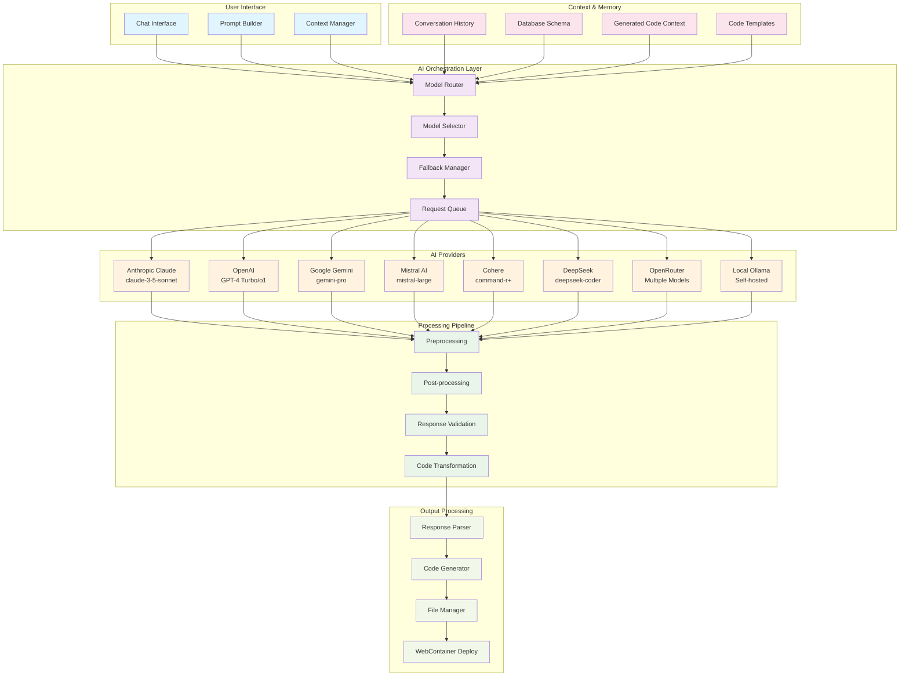

## Model Selection Strategy

### Model Router Architecture

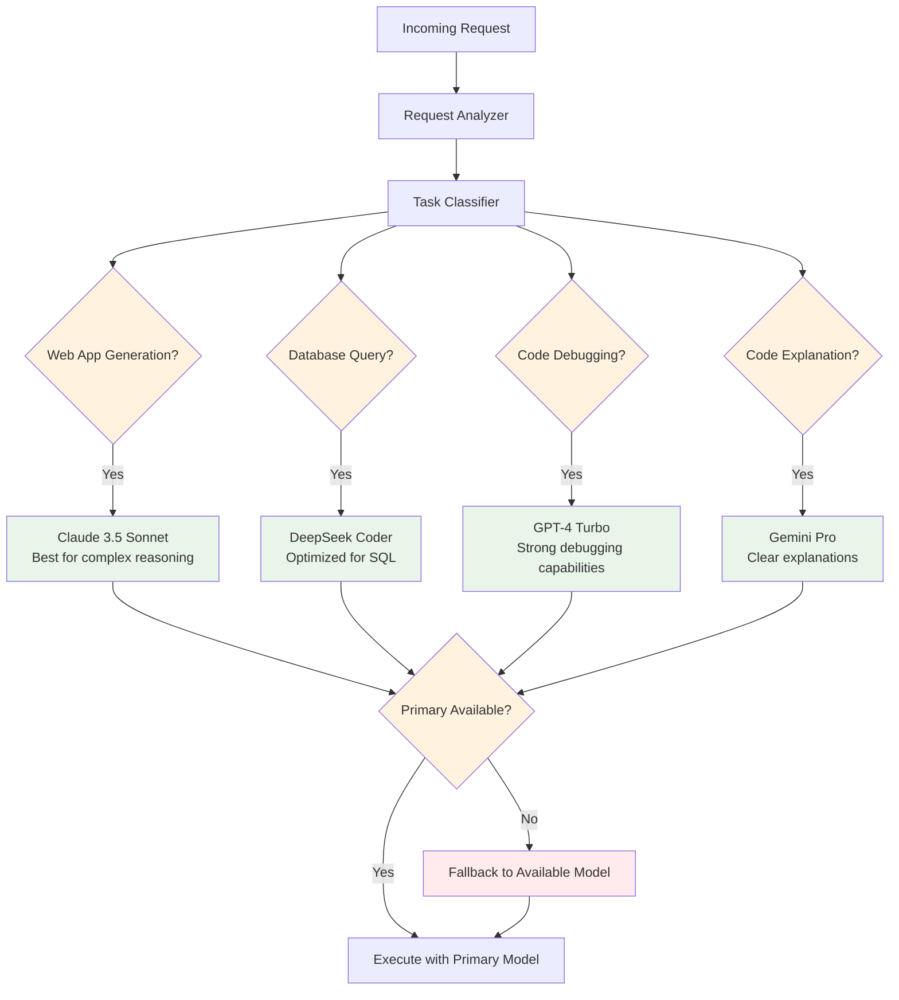

### Model Configuration

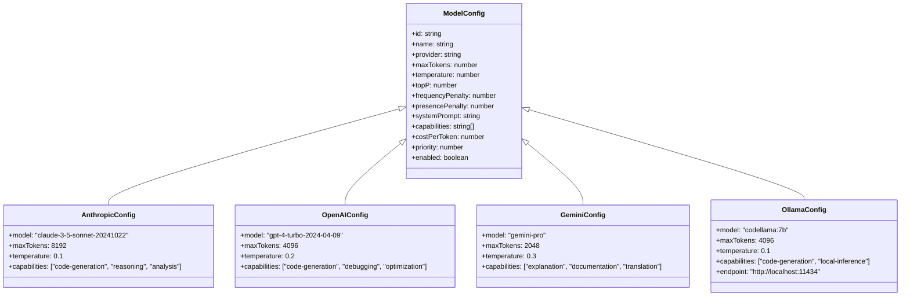

## Prompt Engineering

### System Prompt Architecture

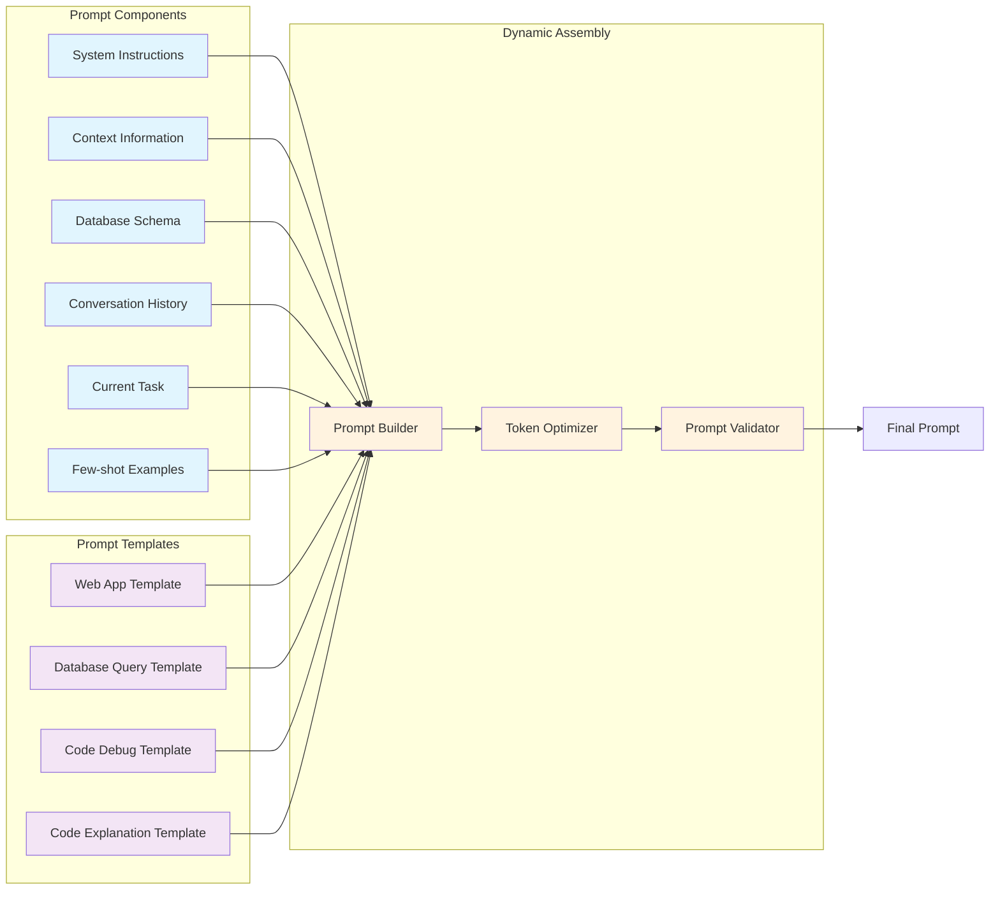

### Context Management

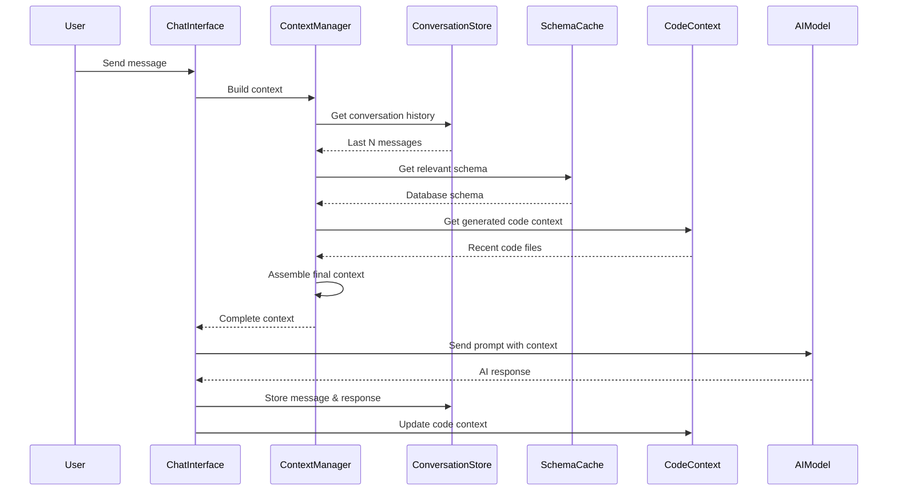

## AI Response Processing

### Response Processing Pipeline

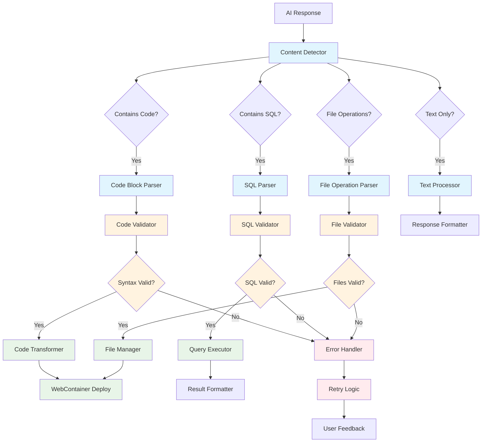

### Code Generation Flow

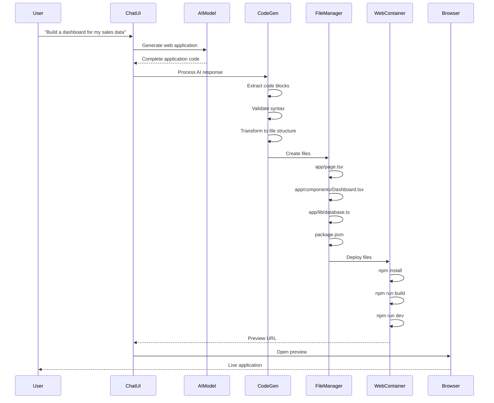

## Performance Optimization

### Request Optimization

```mermaid
graph LR
    subgraph "Request Processing"
        QUEUE[Request Queue]
        BATCH[Batch Processor]
        CACHE[Response Cache]
        PRIORITY[Priority Queue]
    end

    subgraph "Model Optimization"
        TOKENIZER[Token Optimizer]
        COMPRESSION[Context Compression]
        STREAMING[Streaming Response]
        PARALLEL[Parallel Processing]
    end

    subgraph "Resource Management"
        RATELIMIT[Rate Limiting]
        LOAD_BALANCE[Load Balancer]
        CIRCUIT_BREAKER[Circuit Breaker]
        RETRY[Retry Logic]
    end

    REQUEST[User Request] --> QUEUE
    QUEUE --> BATCH
    BATCH --> CACHE
    CACHE --> PRIORITY

    PRIORITY --> TOKENIZER
    TOKENIZER --> COMPRESSION
    COMPRESSION --> STREAMING
    STREAMING --> PARALLEL

    PARALLEL --> RATELIMIT
    RATELIMIT --> LOAD_BALANCE
    LOAD_BALANCE --> CIRCUIT_BREAKER
    CIRCUIT_BREAKER --> RETRY

    RETRY --> AI_RESPONSE[AI Response]

    classDef processing fill:#e1f5fe
    classDef optimization fill:#f3e5f5
    classDef management fill:#fff3e0

    class QUEUE,BATCH,CACHE,PRIORITY processing
    class TOKENIZER,COMPRESSION,STREAMING,PARALLEL optimization
    class RATELIMIT,LOAD_BALANCE,CIRCUIT_BREAKER,RETRY management
```

### Caching Strategy

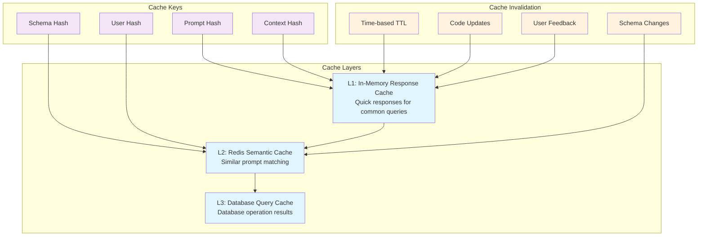

## Model Monitoring & Analytics

### Performance Metrics

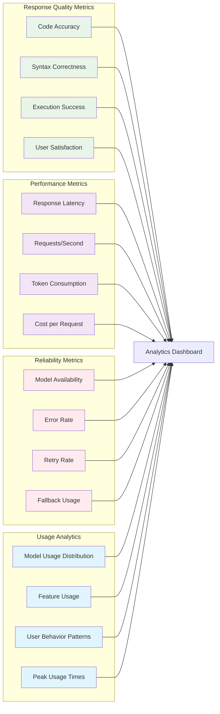

## Error Handling & Fallbacks

### Error Handling Strategy

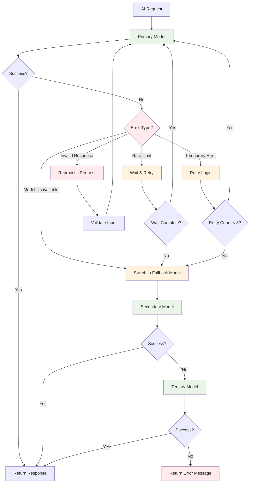

## Security Considerations

### API Key Management

1. **Secure Storage**: All API keys encrypted in Vault
2. **Key Rotation**: Automatic rotation of API keys
3. **Usage Tracking**: Monitor API key usage and costs
4. **Rate Limiting**: Prevent abuse of AI services
5. **Request Validation**: Validate all requests before processing

### Content Filtering

1. **Input Sanitization**: Clean user inputs before processing
2. **Output Validation**: Validate AI responses for safety
3. **Code Security**: Scan generated code for security vulnerabilities
4. **Prompt Injection**: Prevent prompt injection attacks
5. **Content Moderation**: Filter inappropriate content

## Cost Management

### Cost Optimization Strategies

1. **Model Selection**: Choose cost-effective models per use case
2. **Token Optimization**: Minimize token usage through compression
3. **Response Caching**: Cache responses to reduce API calls
4. **Batch Processing**: Process multiple requests together
5. **Usage Monitoring**: Track costs per user and feature

This AI integration architecture provides a robust, scalable, and cost-effective foundation for delivering intelligent AI-powered development experiences.
