# API Architecture

## Overview

The liblab.ai platform implements a comprehensive API architecture that provides secure, scalable, and well-structured endpoints for all platform functionality. The architecture follows REST principles with GraphQL support for complex queries, implements robust authentication and authorization, and provides real-time capabilities through WebSocket connections.

## API Architecture Overview

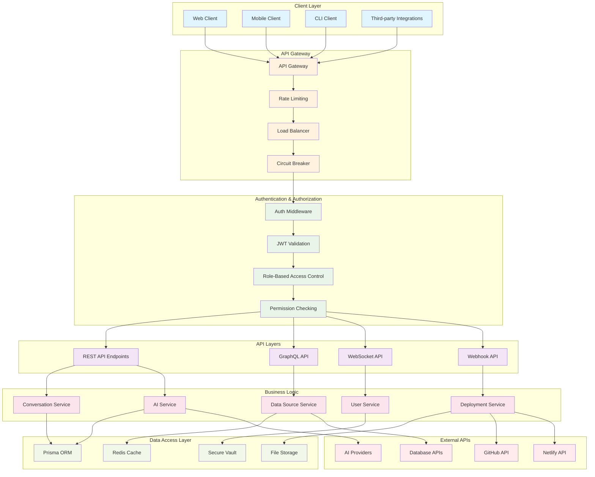

## REST API Structure

### API Endpoint Organization

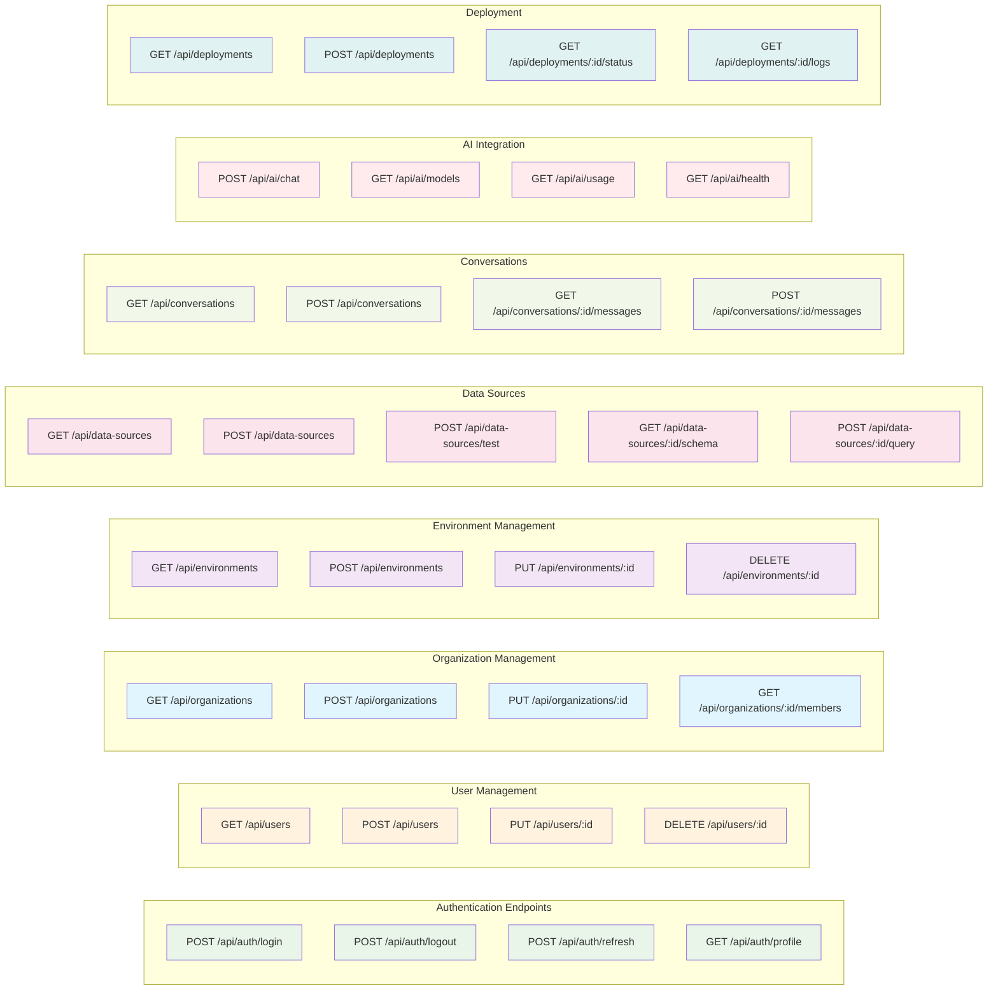

### Request/Response Flow

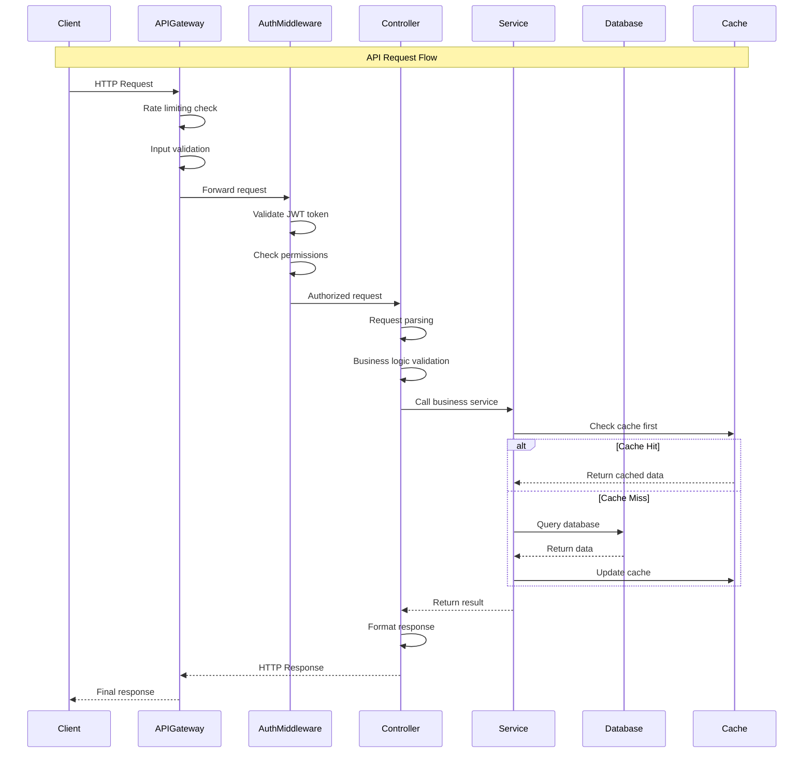

## GraphQL Integration

### GraphQL Schema Structure

```mermaid
graph TB
    subgraph "Root Types"
        QUERY[Query<br/>Read operations]
        MUTATION[Mutation<br/>Write operations]
        SUBSCRIPTION[Subscription<br/>Real-time updates]
    end

    subgraph "Core Types"
        USER[User<br/>User information]
        ORGANIZATION[Organization<br/>Organization data]
        ENVIRONMENT[Environment<br/>Environment settings]
        DATASOURCE[DataSource<br/>Database connections]
    end

    subgraph "Conversation Types"
        CONVERSATION[Conversation<br/>Chat sessions]
        MESSAGE[Message<br/>Individual messages]
        SNAPSHOT[Snapshot<br/>Code snapshots]
        WEBSITE[Website<br/>Generated apps]
    end

    subgraph "AI Types"
        AI_MODEL[AIModel<br/>Model information]
        AI_RESPONSE[AIResponse<br/>AI responses]
        CODE_GENERATION[CodeGeneration<br/>Generated code]
        QUERY_EXECUTION[QueryExecution<br/>Database queries]
    end

    subgraph "Deployment Types"
        DEPLOYMENT[Deployment<br/>Deployment info]
        BUILD[Build<br/>Build process]
        DEPLOYMENT_LOG[DeploymentLog<br/>Build logs]
        DEPLOYMENT_STATUS[DeploymentStatus<br/>Status info]
    end

    QUERY --> USER
    QUERY --> ORGANIZATION
    QUERY --> ENVIRONMENT
    QUERY --> DATASOURCE

    MUTATION --> CONVERSATION
    MUTATION --> MESSAGE
    MUTATION --> SNAPSHOT
    MUTATION --> WEBSITE

    SUBSCRIPTION --> AI_MODEL
    SUBSCRIPTION --> AI_RESPONSE
    SUBSCRIPTION --> CODE_GENERATION
    SUBSCRIPTION --> QUERY_EXECUTION

    AI_RESPONSE --> DEPLOYMENT
    CODE_GENERATION --> BUILD
    QUERY_EXECUTION --> DEPLOYMENT_LOG
    WEBSITE --> DEPLOYMENT_STATUS

    classDef root fill:#e8f5e8
    classDef core fill:#fff3e0
    classDef conv fill:#e1f5fe
    classDef ai fill:#f3e5f5
    classDef deploy fill:#fce4ec

    class QUERY,MUTATION,SUBSCRIPTION root
    class USER,ORGANIZATION,ENVIRONMENT,DATASOURCE core
    class CONVERSATION,MESSAGE,SNAPSHOT,WEBSITE conv
    class AI_MODEL,AI_RESPONSE,CODE_GENERATION,QUERY_EXECUTION ai
    class DEPLOYMENT,BUILD,DEPLOYMENT_LOG,DEPLOYMENT_STATUS deploy
```

### GraphQL Resolvers Architecture

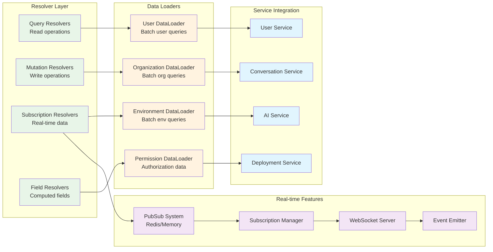

## WebSocket API

### Real-time Communication Architecture

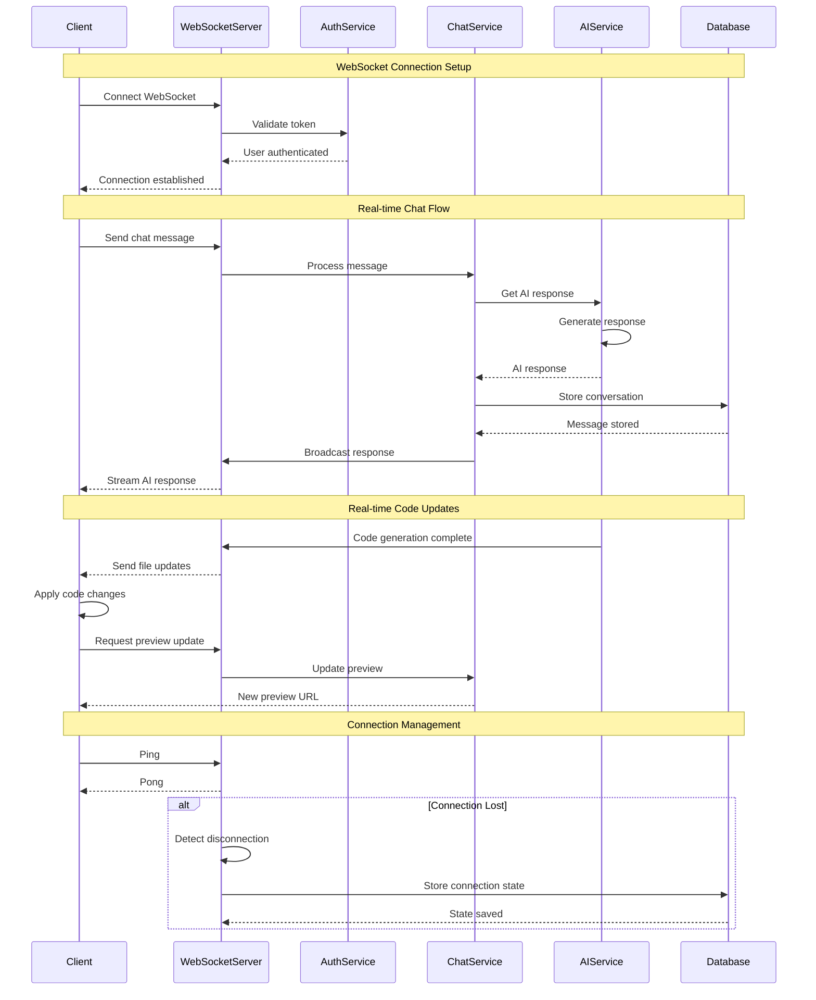

### WebSocket Event Types

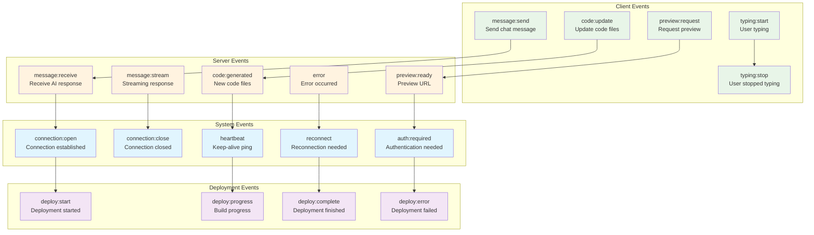

## API Security

### Authentication & Authorization Flow

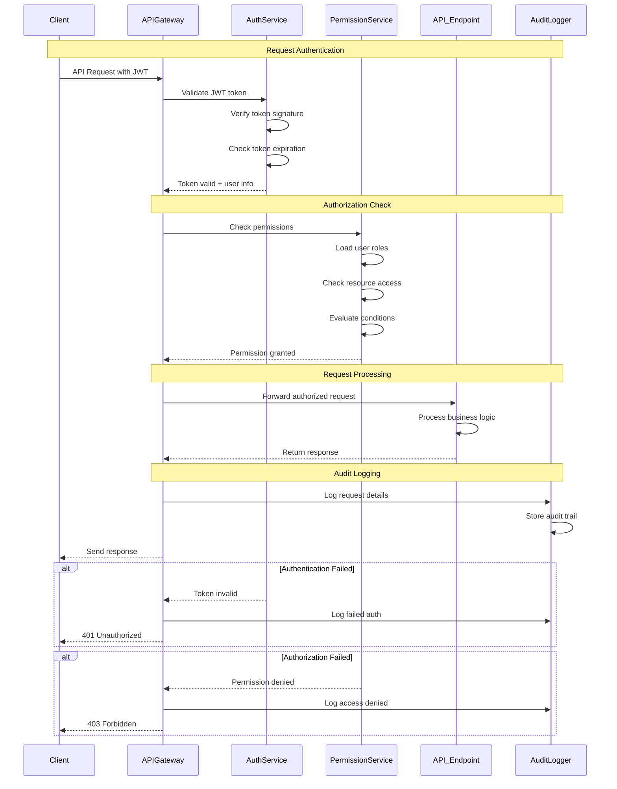

### Rate Limiting & Throttling

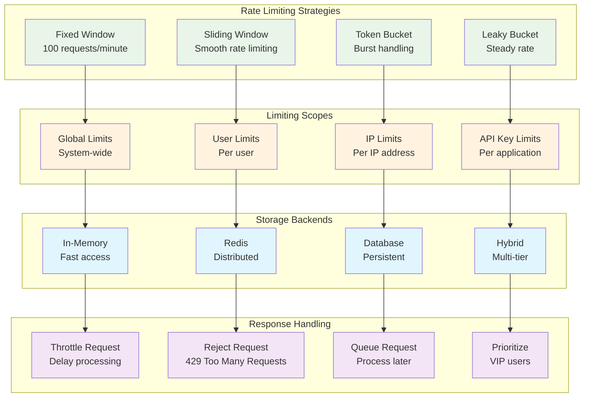

## API Documentation

### OpenAPI Specification Structure

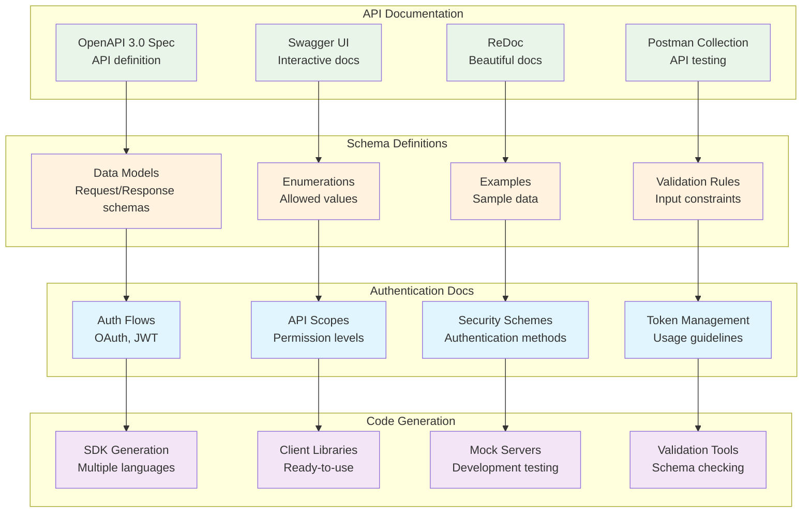

## API Monitoring & Analytics

### API Performance Monitoring

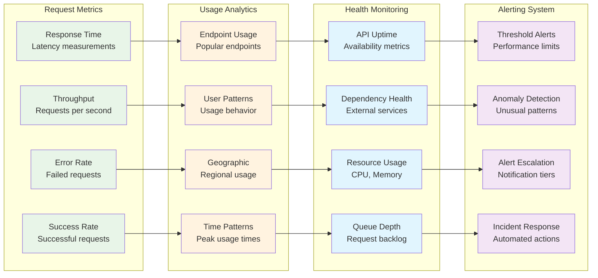

## Error Handling & Recovery

### API Error Response Strategy

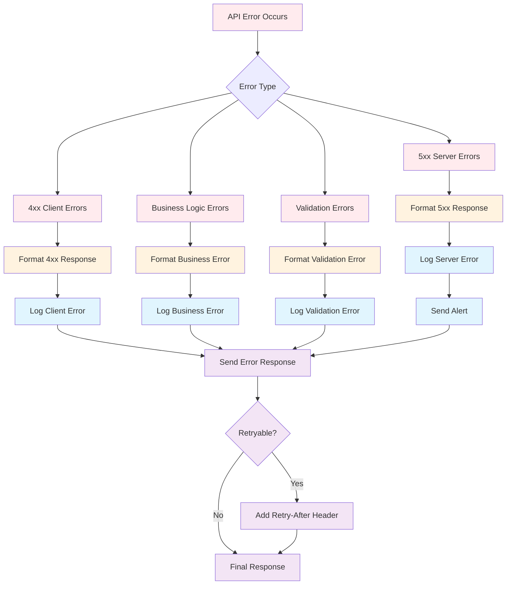

## API Versioning Strategy

### Version Management

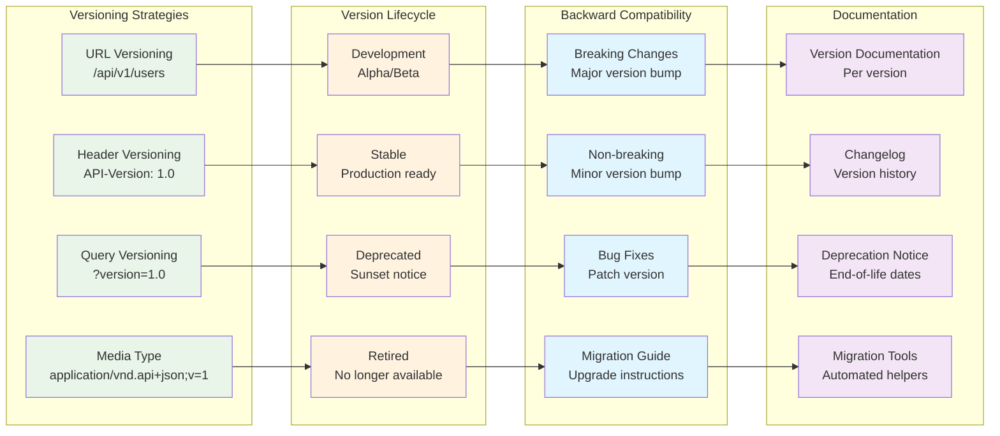

This comprehensive API architecture provides a robust foundation for secure, scalable, and maintainable API services that support the full range of liblab.ai platform functionality while ensuring excellent developer experience and system reliability.
