# Authentication & Security Architecture

## Overview

The liblab.ai platform implements a comprehensive security model that protects user data, secures database connections, and maintains the integrity of the AI-powered development environment. The architecture follows security-first principles with multiple layers of protection and defense-in-depth strategies.

## Security Architecture Overview

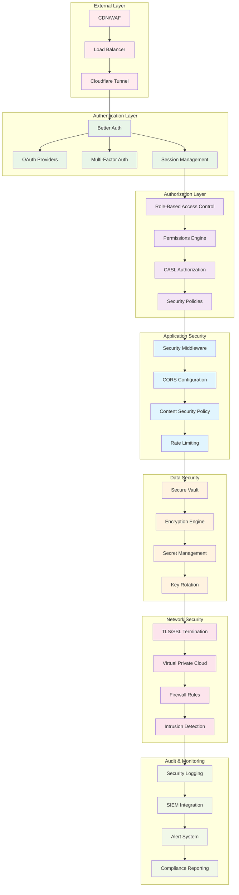

## Authentication System

### Authentication Flow

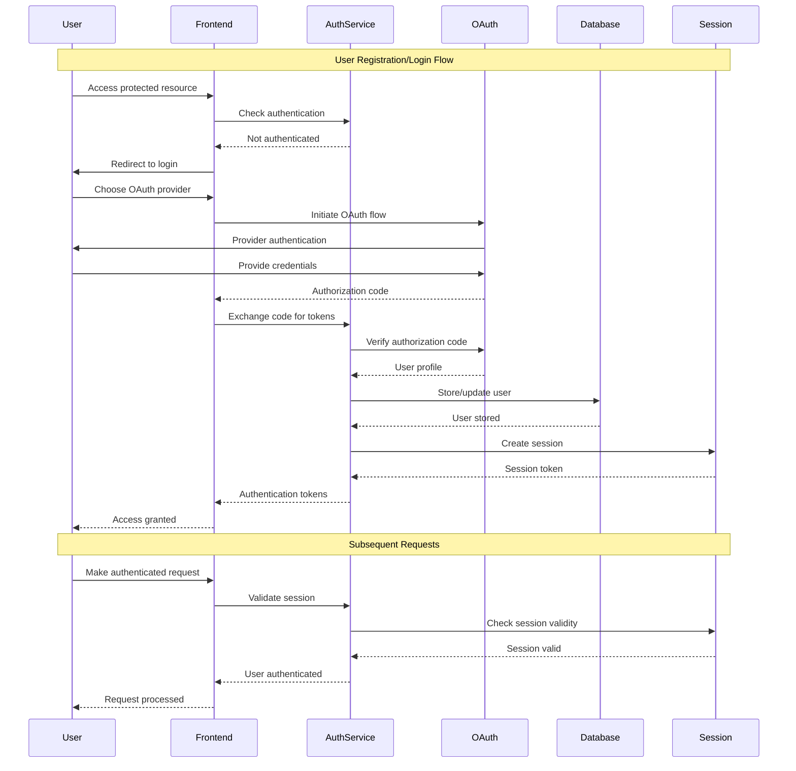

### Multi-Factor Authentication

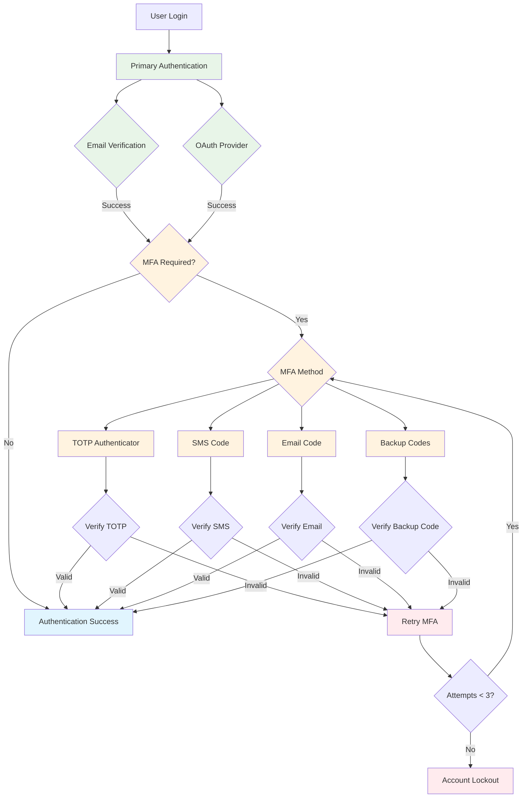

## Authorization System

### Role-Based Access Control (RBAC)

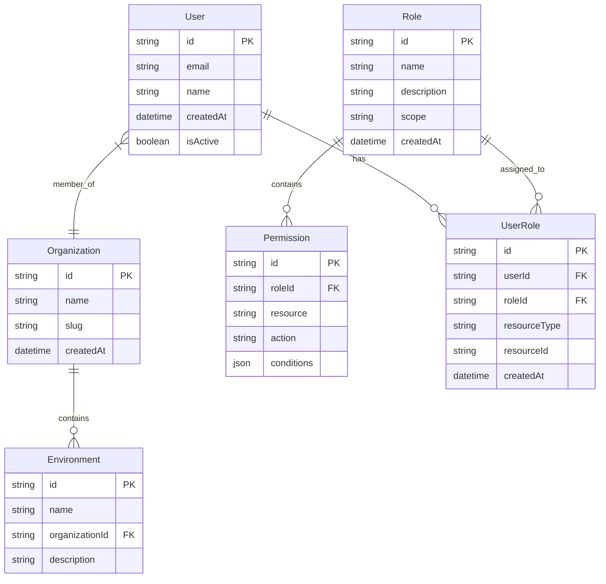

### Permission Matrix

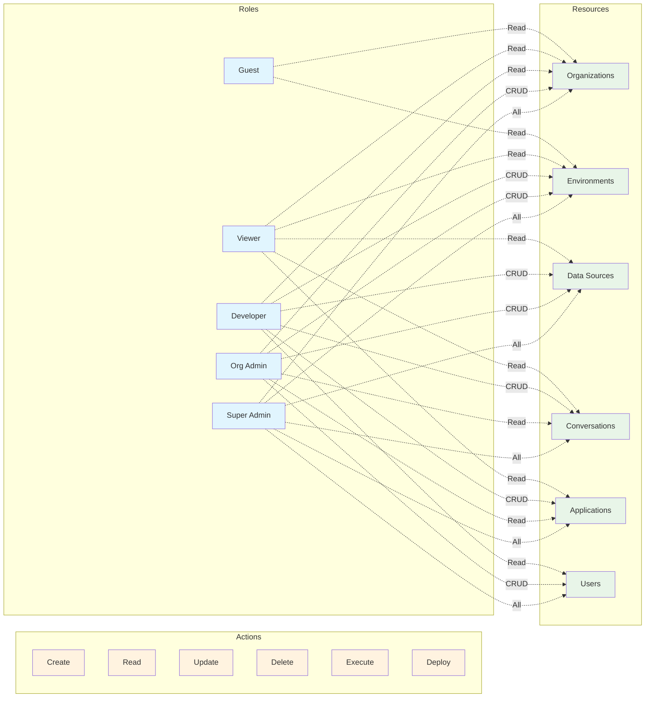

### CASL Integration

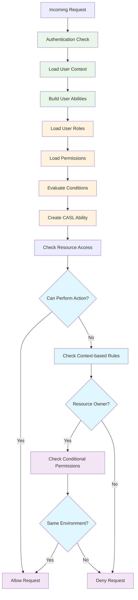

## Data Security

### Encryption Architecture

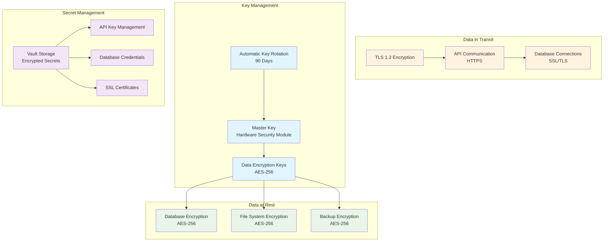

### Secure Database Connections

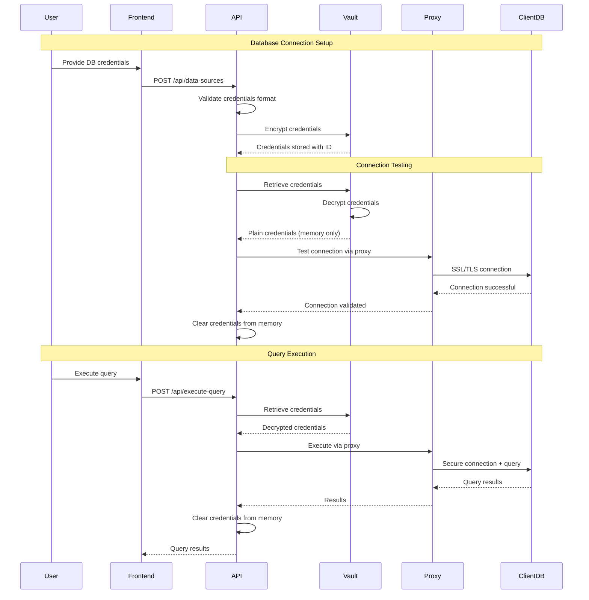

## Application Security

### Security Middleware Stack

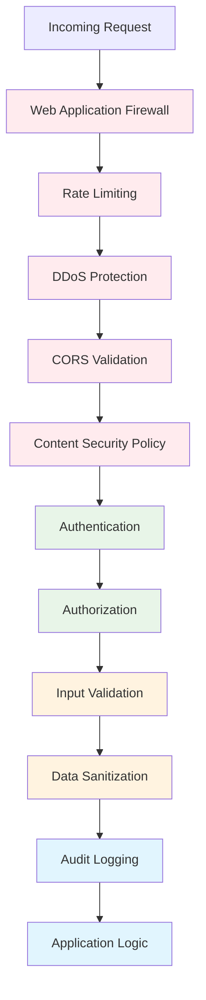

### Input Validation & Sanitization

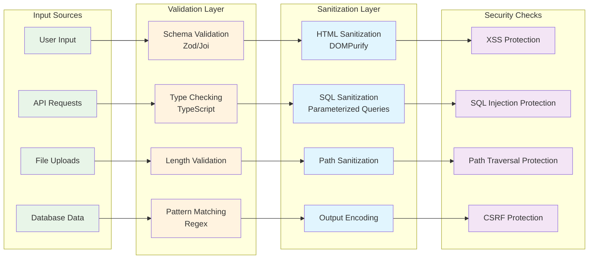

## Security Monitoring & Incident Response

### Security Event Monitoring

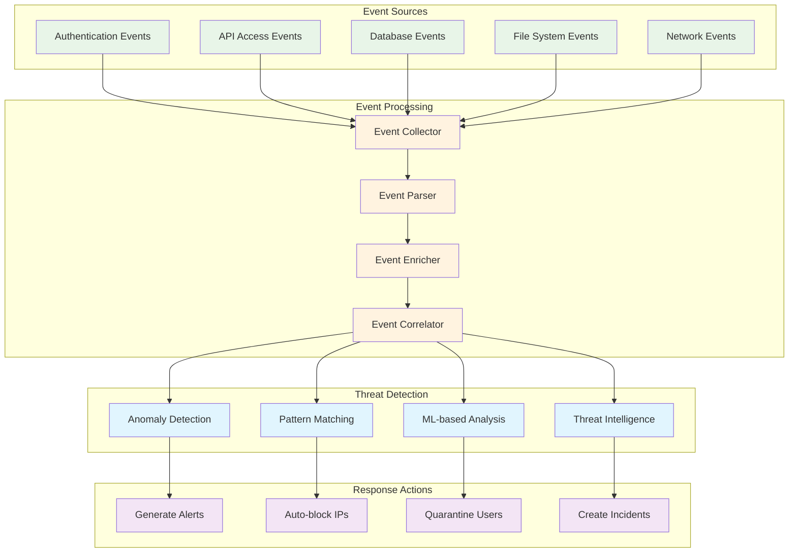

### Incident Response Flow

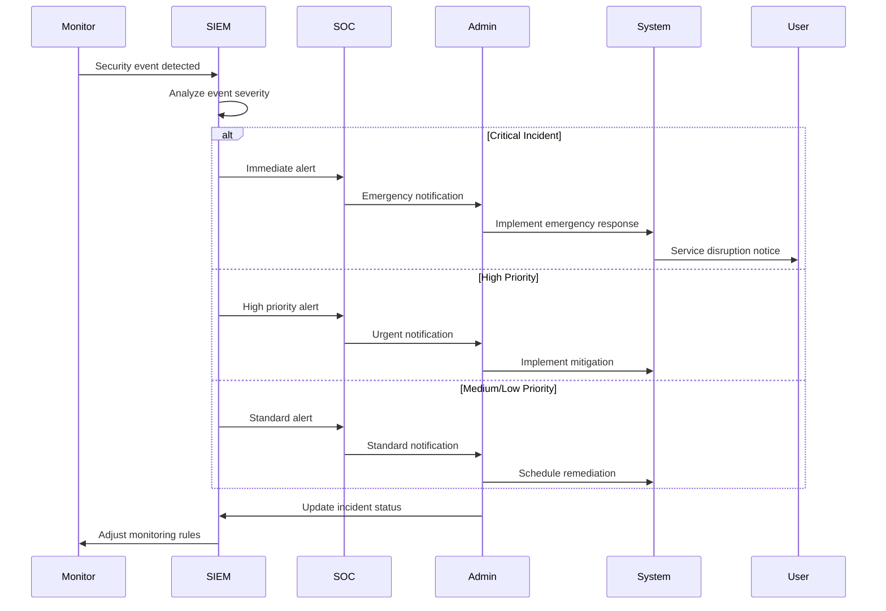

## Compliance & Audit

### Audit Trail Architecture

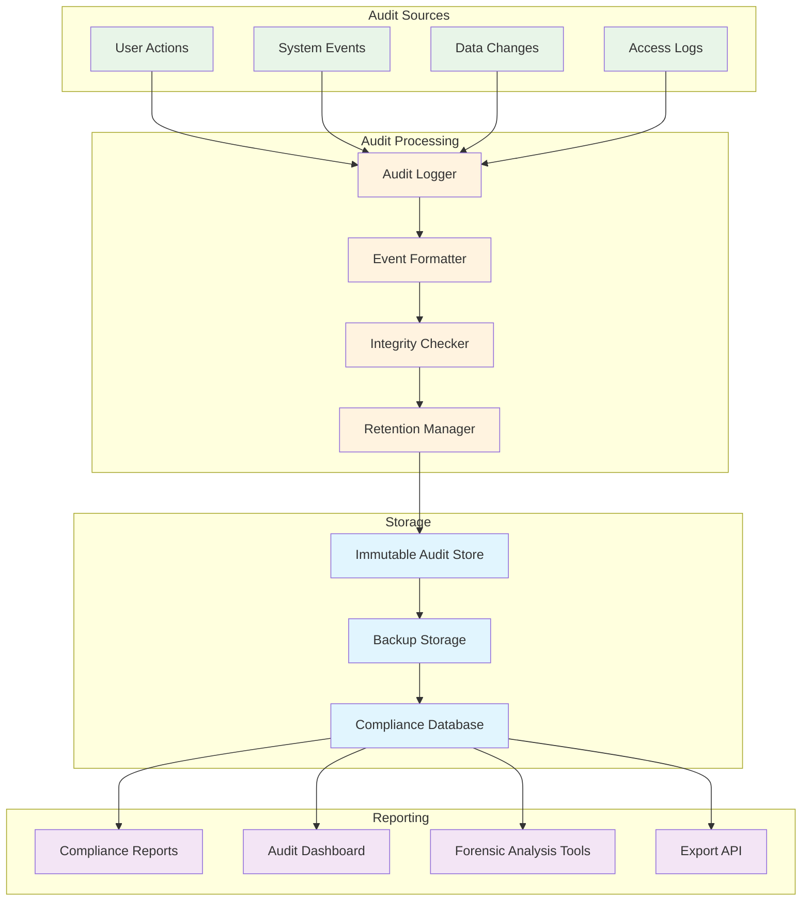

## Security Best Practices

### Security Checklist

1. **Authentication**
   - Multi-factor authentication enabled
   - Strong password policies enforced
   - Session management secure
   - OAuth integration properly configured

2. **Authorization**
   - Role-based access control implemented
   - Principle of least privilege applied
   - Regular permission audits conducted
   - Context-based access decisions

3. **Data Protection**
   - Encryption at rest and in transit
   - Secure key management
   - Regular key rotation
   - Backup encryption

4. **Application Security**
   - Input validation and sanitization
   - OWASP Top 10 protections
   - Secure coding practices
   - Regular security testing

5. **Infrastructure Security**
   - Network segmentation
   - Firewall configurations
   - Intrusion detection systems
   - Regular security updates

6. **Monitoring & Response**
   - Comprehensive logging
   - Real-time monitoring
   - Incident response procedures
   - Regular security assessments

This security architecture provides comprehensive protection while maintaining usability and performance for the AI-powered development platform.
