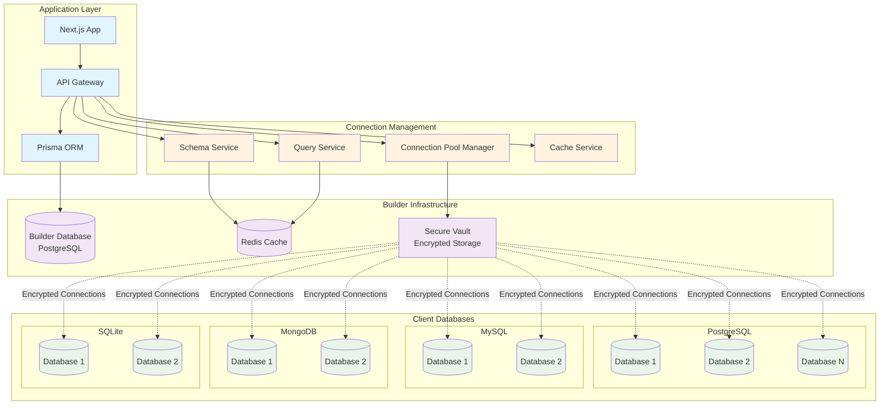
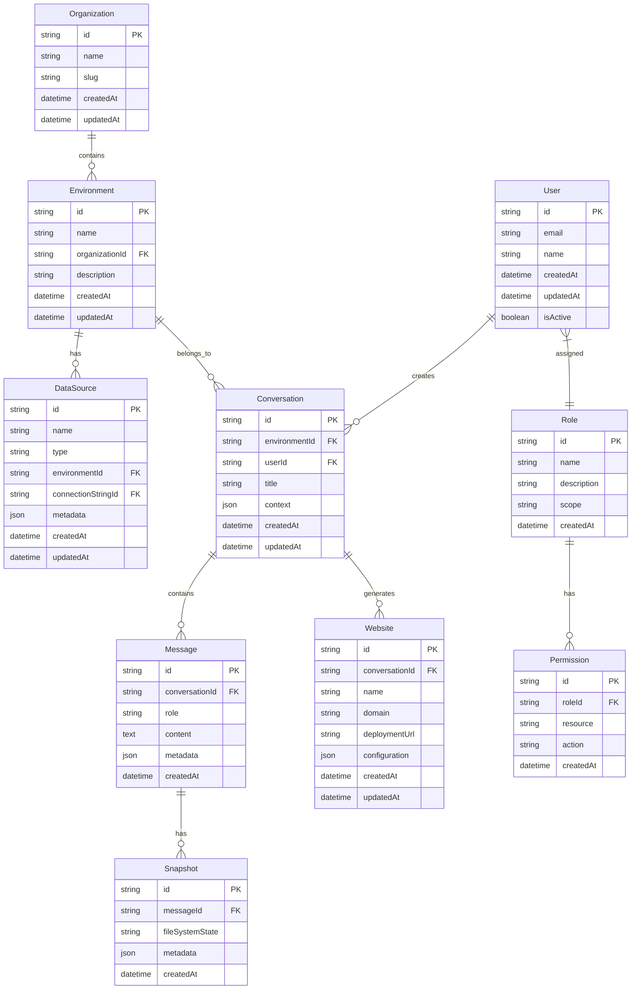
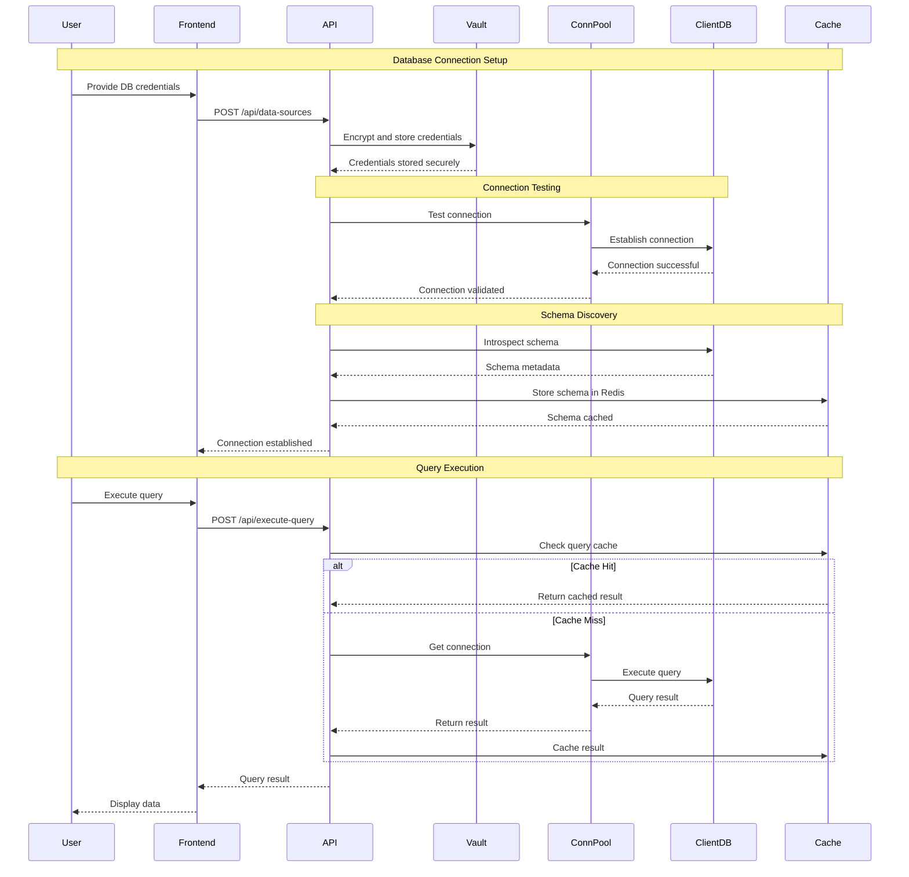
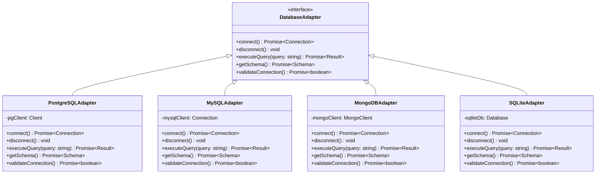
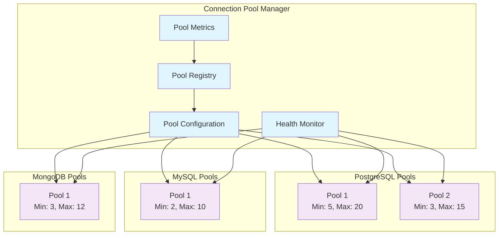
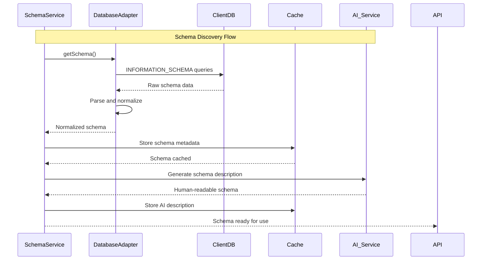
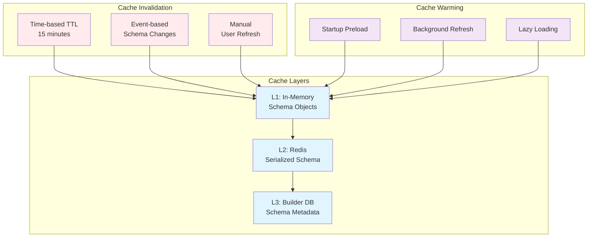
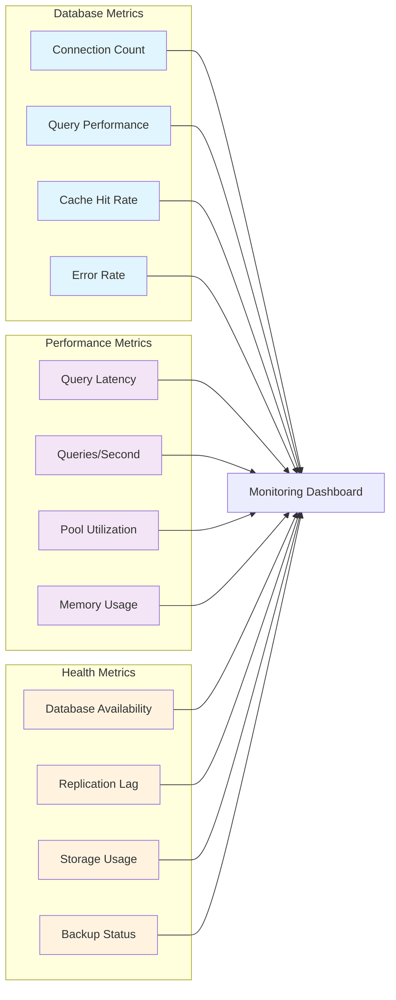

# Database Architecture

## Overview

The liblab.ai platform implements a sophisticated multi-database architecture that supports connecting to and working with various database systems while maintaining security, performance, and scalability. The architecture separates the platform's internal database (Builder Database) from user-connected databases (Client Databases).

## Database Architecture Overview

## Builder Database Schema

The Builder Database stores all platform metadata, user data, and application configurations.

### Core Entities

## Database Connection Patterns

### Connection Lifecycle

### Query Execution Architecture

```mermaid
graph LR
    subgraph "Query Processing Pipeline"
        PARSE[Query Parser]
        VALIDATE[Validator]
        OPTIMIZE[Query Optimizer]
        EXECUTE[Query Executor]
        FORMAT[Result Formatter]
    end

    subgraph "Security Layer"
        AUTHZ[Authorization Check]
        SANITIZE[SQL Injection Protection]
        RATELIMIT[Rate Limiting]
    end

    subgraph "Performance Layer"
        QUERYCACHE[Query Cache]
        CONNPOOL[Connection Pool]
        METRICS[Performance Metrics]
    end

    INPUT[Raw Query] --> PARSE
    PARSE --> VALIDATE
    VALIDATE --> AUTHZ
    AUTHZ --> SANITIZE
    SANITIZE --> RATELIMIT
    RATELIMIT --> OPTIMIZE
    OPTIMIZE --> QUERYCACHE

    QUERYCACHE --> EXECUTE
    EXECUTE --> CONNPOOL
    CONNPOOL --> FORMAT
    FORMAT --> METRICS
    METRICS --> OUTPUT[Query Result]

    classDef processing fill:#e1f5fe
    classDef security fill:#ffebee
    classDef performance fill:#f3e5f5

    class PARSE,VALIDATE,OPTIMIZE,EXECUTE,FORMAT processing
    class AUTHZ,SANITIZE,RATELIMIT security
    class QUERYCACHE,CONNPOOL,METRICS performance
```

## Multi-Database Support

### Database Type Abstraction

### Connection Pool Management

## Schema Management

### Schema Discovery Process

### Schema Caching Strategy

## Performance Optimizations

### Query Optimization Strategies

1. **Query Caching**: Redis-based caching of frequently executed queries
2. **Connection Pooling**: Efficient reuse of database connections
3. **Schema Caching**: Avoid repeated schema introspection
4. **Prepared Statements**: Reusable compiled query plans
5. **Result Streaming**: Stream large result sets to avoid memory issues

### Monitoring & Metrics

## Security Considerations

### Connection Security

1. **Encrypted Storage**: All connection strings encrypted in Vault
2. **TLS/SSL**: Encrypted connections to all client databases
3. **Credential Rotation**: Automatic rotation of database credentials
4. **Network Isolation**: VPC and firewall rules for database access
5. **Audit Logging**: Complete audit trail of database operations

### Access Control

1. **Role-based Access**: Fine-grained permissions per database
2. **Query Whitelisting**: Approved query patterns only
3. **Data Masking**: Sensitive data masking in development environments
4. **Row-level Security**: Database-native security policies
5. **Rate Limiting**: Prevent abuse and DoS attacks

## Backup & Recovery

### Backup Strategies

1. **Automated Backups**: Regular snapshots of Builder Database
2. **Point-in-time Recovery**: Transaction log backups
3. **Cross-region Replication**: Geographic backup distribution
4. **Schema Versioning**: Track schema changes over time
5. **Disaster Recovery**: Complete system recovery procedures

This database architecture ensures secure, scalable, and performant access to multiple database systems while maintaining data integrity and user privacy.
