# Deployment Architecture

## Overview

The liblab.ai platform provides comprehensive deployment capabilities that take generated applications from development to production. The architecture supports multiple deployment targets, automated CI/CD pipelines, and scalable infrastructure management while maintaining security and performance standards.

## Deployment Architecture Overview

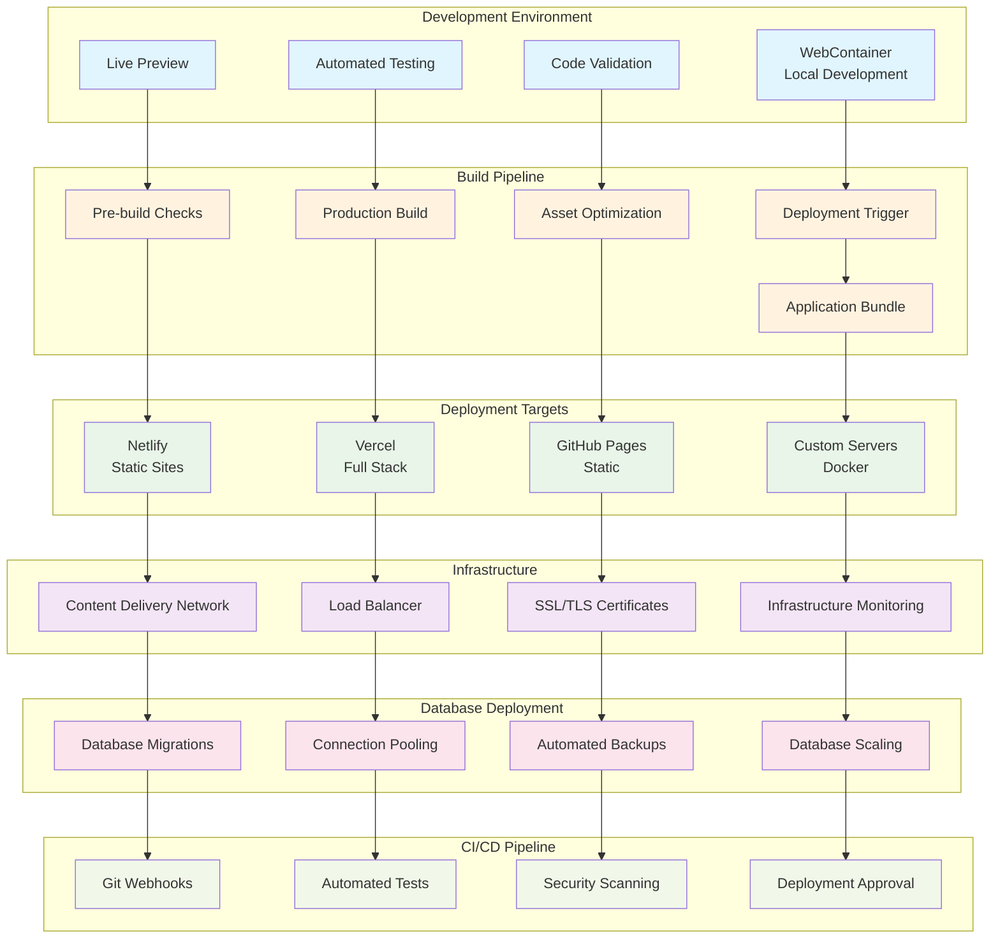

## Deployment Flow

### End-to-End Deployment Process

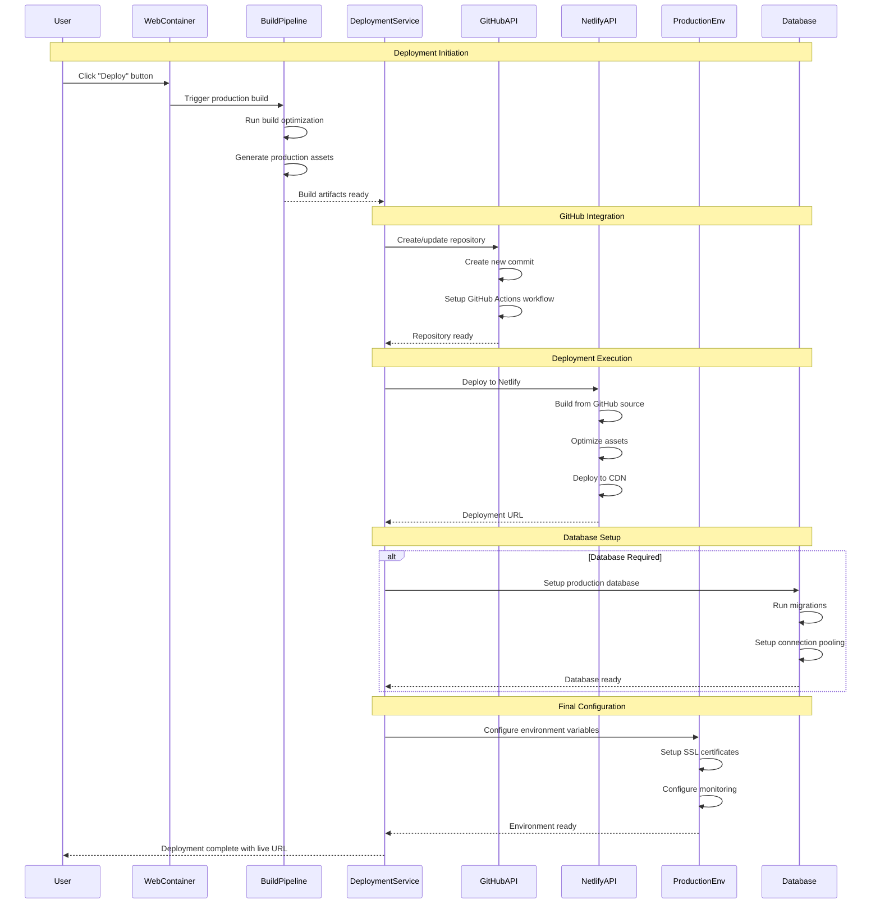

## Docker Deployment

### Docker Container Architecture

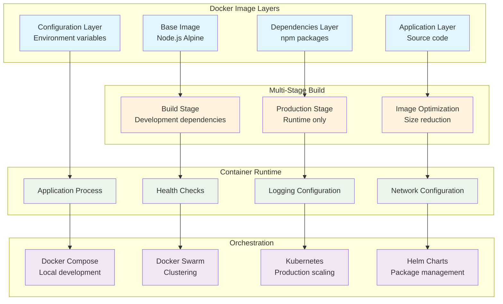

### Docker Compose Configuration

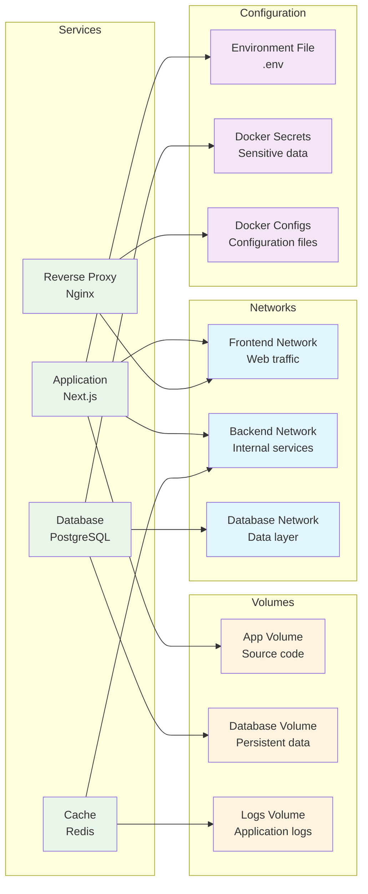

## Netlify Deployment

### Netlify Integration Architecture

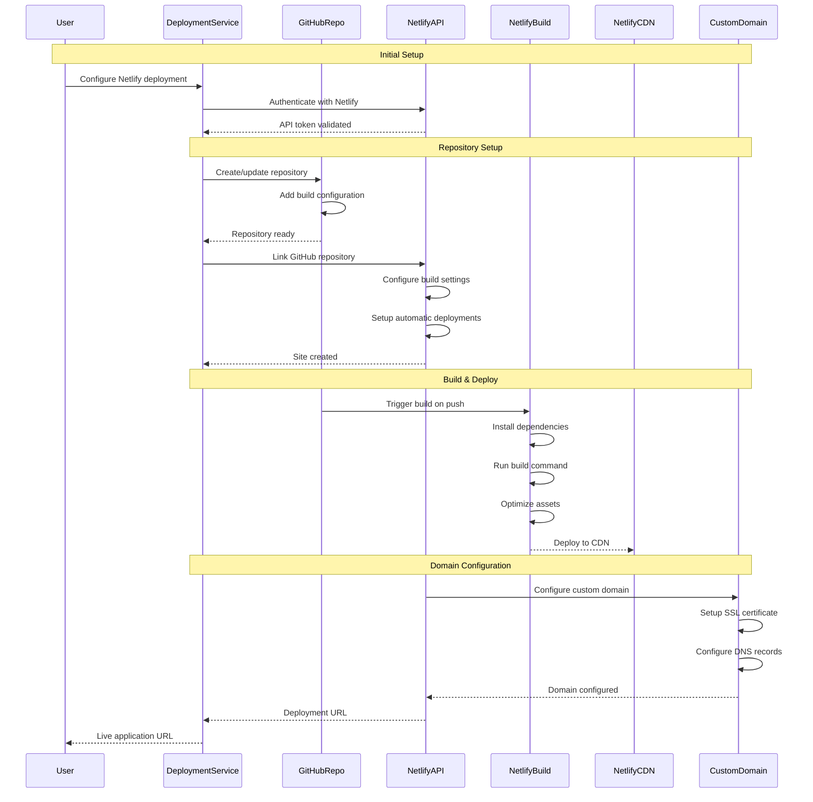

### Netlify Build Configuration

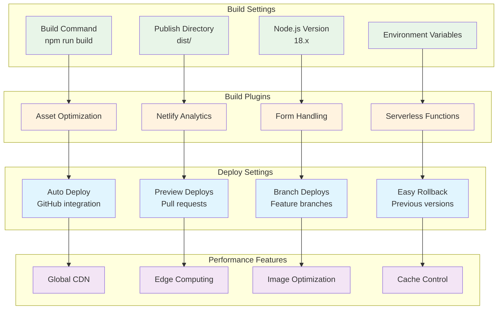

## GitHub Integration

### GitHub Actions Workflow

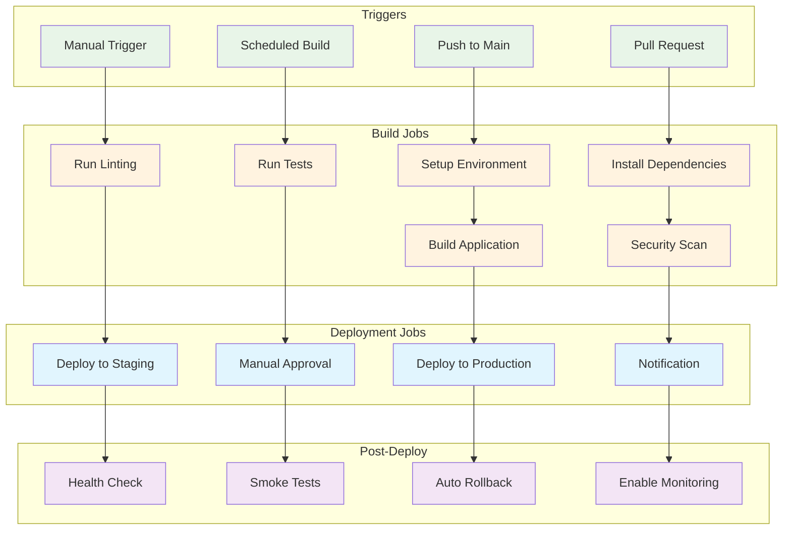

### Repository Structure

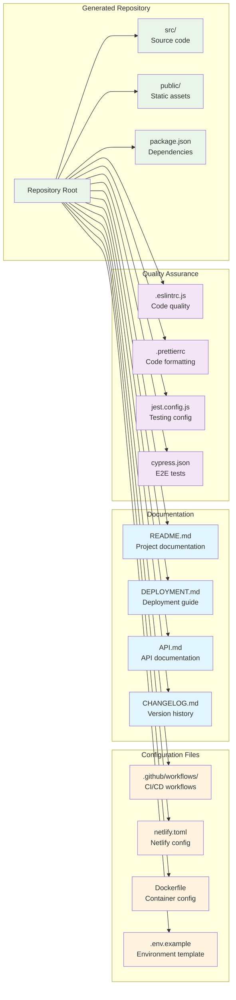

## Production Environment

### Infrastructure Scaling

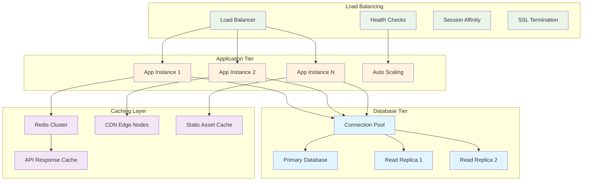

### Monitoring & Observability

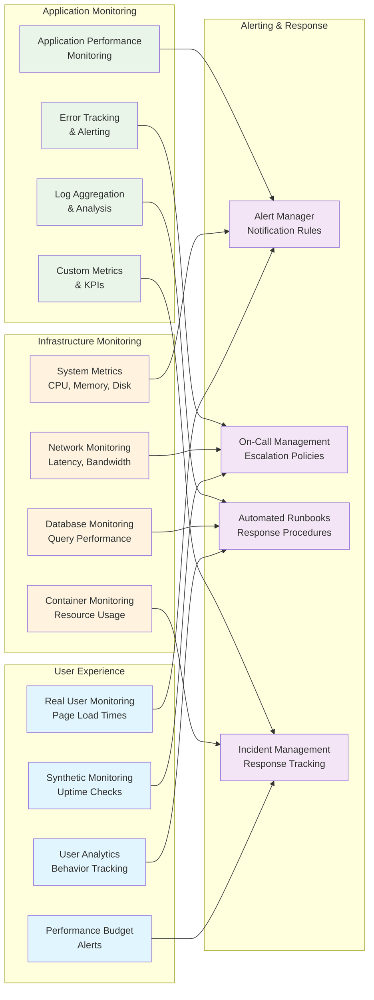

## Deployment Security

### Security Pipeline

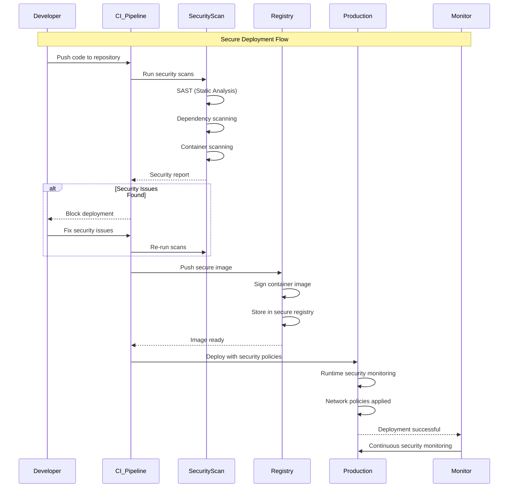

## Backup & Disaster Recovery

### Backup Strategy

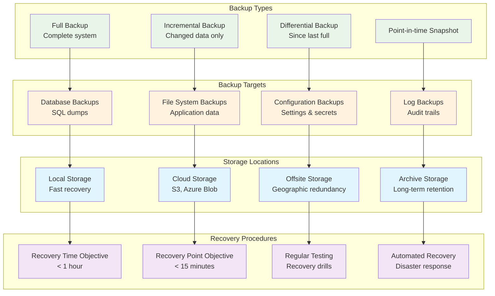

This deployment architecture provides comprehensive, secure, and scalable deployment capabilities that support the full lifecycle from development to production, with robust monitoring, security, and disaster recovery features.
