# Development Workflow Architecture

## Overview

The liblab.ai platform provides an end-to-end development workflow that transforms natural language descriptions into fully functional web applications. The architecture seamlessly integrates AI-powered code generation, real-time code execution, and live preview capabilities through the WebContainer technology.

## Development Workflow Overview

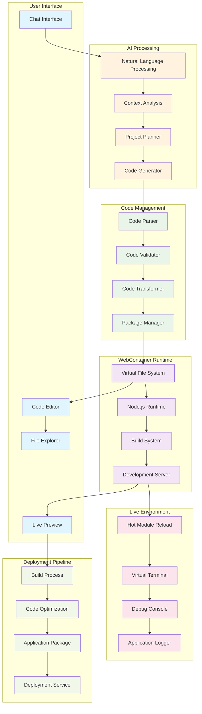

## Code Generation Pipeline

### Natural Language to Code Flow

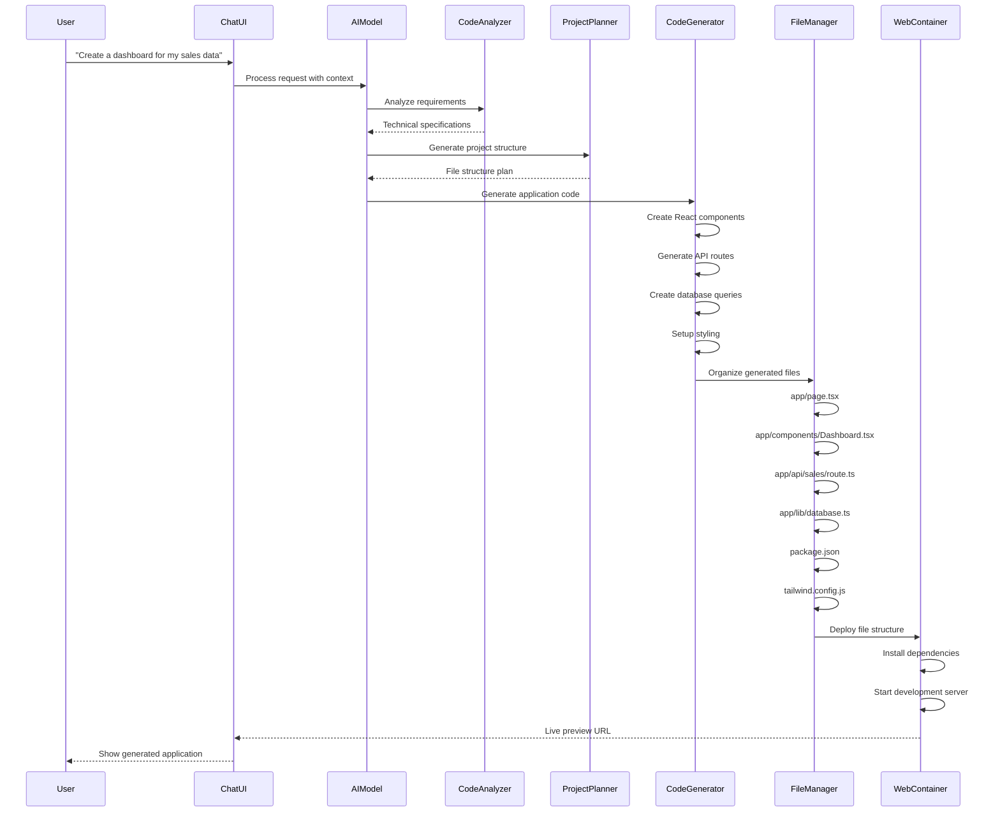

### Code Analysis & Validation

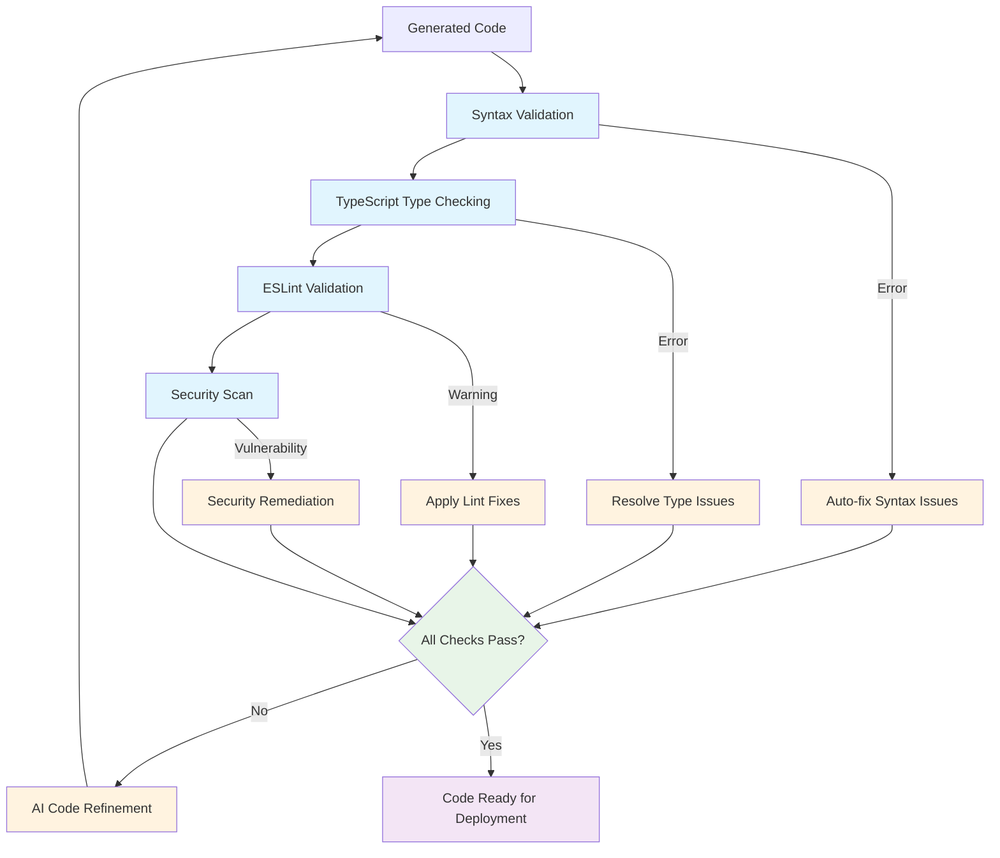

## WebContainer Architecture

### WebContainer Runtime Environment

```mermaid
graph TB
    subgraph "Browser Environment"
        IFRAME[Sandboxed iFrame]
        WORKER[Service Worker]
        STORAGE[Local Storage]
    end

    subgraph "WebContainer Core"
        FS[Virtual File System]
        PROCESS[Process Manager]
        NETWORK[Network Layer]
        SHELL[Shell Interface]
    end

    subgraph "Node.js Runtime"
        V8[V8 Engine]
        MODULES[Node Modules]
        STREAMS[Streams API]
        EVENTS[Event System]
    end

    subgraph "Build Tools"
        VITE[Vite Bundler]
        WEBPACK[Webpack (fallback)]
        BABEL[Babel Transpiler]
        TYPESCRIPT[TypeScript Compiler]
    end

    subgraph "Development Server"
        SERVER[HTTP Server]
        WEBSOCKET[WebSocket]
        HMR[Hot Module Reload]
        PROXY[API Proxy]
    end

    IFRAME --> FS
    WORKER --> PROCESS
    STORAGE --> NETWORK

    FS --> V8
    PROCESS --> MODULES
    NETWORK --> STREAMS
    SHELL --> EVENTS

    V8 --> VITE
    MODULES --> WEBPACK
    STREAMS --> BABEL
    EVENTS --> TYPESCRIPT

    VITE --> SERVER
    WEBPACK --> WEBSOCKET
    BABEL --> HMR
    TYPESCRIPT --> PROXY

    classDef browser fill:#e1f5fe
    classDef core fill:#fff3e0
    classDef runtime fill:#e8f5e8
    classDef build fill:#f3e5f5
    classDef server fill:#fce4ec

    class IFRAME,WORKER,STORAGE browser
    class FS,PROCESS,NETWORK,SHELL core
    class V8,MODULES,STREAMS,EVENTS runtime
    class VITE,WEBPACK,BABEL,TYPESCRIPT build
    class SERVER,WEBSOCKET,HMR,PROXY server
```

### File System Operations

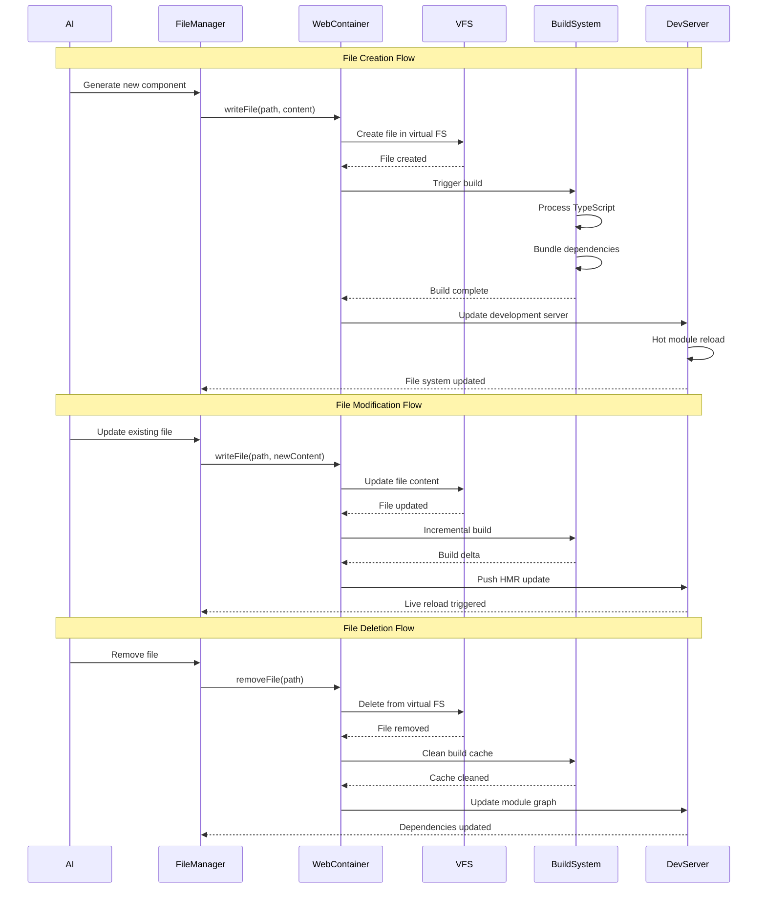

## Hot Module Reload (HMR)

### HMR Architecture

```mermaid
graph LR
    subgraph "Development Workflow"
        EDIT[File Edit]
        DETECT[Change Detection]
        COMPILE[Incremental Compile]
        UPDATE[Module Update]
    end

    subgraph "HMR System"
        WATCHER[File Watcher]
        COMPILER[Module Compiler]
        RUNTIME[HMR Runtime]
        CLIENT[HMR Client]
    end

    subgraph "Browser Environment"
        MODULE_CACHE[Module Cache]
        REACT_REFRESH[React Fast Refresh]
        STATE_PRESERVATION[State Preservation]
        DOM_UPDATE[DOM Update]
    end

    subgraph "Communication"
        WEBSOCKET[WebSocket Connection]
        EVENTS[HMR Events]
        MANIFEST[Update Manifest]
        ERRORS[Error Handling]
    end

    EDIT --> WATCHER
    WATCHER --> DETECT
    DETECT --> COMPILER
    COMPILER --> COMPILE
    COMPILE --> RUNTIME
    RUNTIME --> UPDATE

    UPDATE --> CLIENT
    CLIENT --> WEBSOCKET
    WEBSOCKET --> EVENTS
    EVENTS --> MANIFEST

    MANIFEST --> MODULE_CACHE
    MODULE_CACHE --> REACT_REFRESH
    REACT_REFRESH --> STATE_PRESERVATION
    STATE_PRESERVATION --> DOM_UPDATE

    ERRORS --> CLIENT

    classDef workflow fill:#e1f5fe
    classDef hmr fill:#fff3e0
    classDef browser fill:#e8f5e8
    classDef comm fill:#f3e5f5

    class EDIT,DETECT,COMPILE,UPDATE workflow
    class WATCHER,COMPILER,RUNTIME,CLIENT hmr
    class MODULE_CACHE,REACT_REFRESH,STATE_PRESERVATION,DOM_UPDATE browser
    class WEBSOCKET,EVENTS,MANIFEST,ERRORS comm
```

### HMR Update Flow

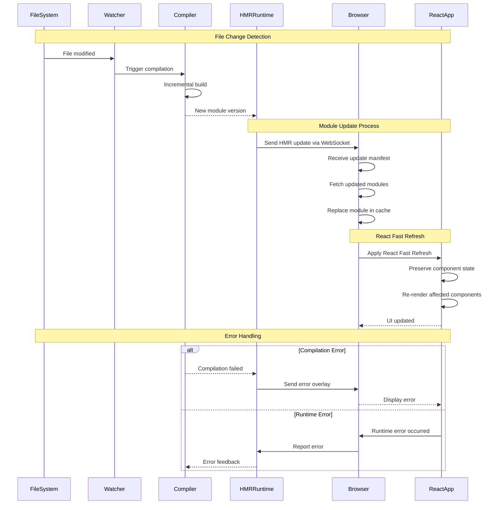

## Development Tools Integration

### Debug Console Architecture

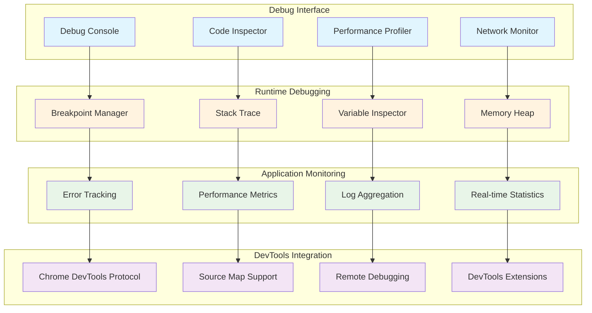

## Package Management

### Dependency Management Flow

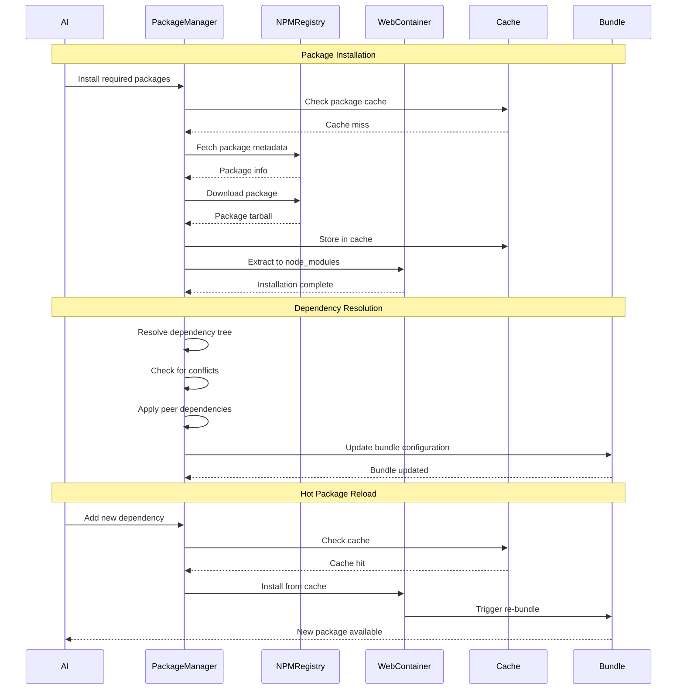

### Build System Integration

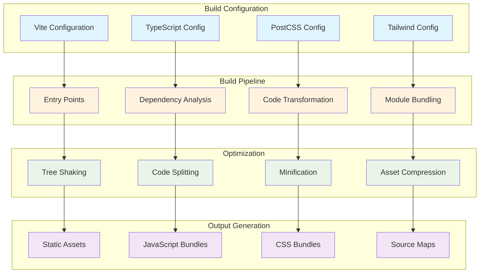

## Error Handling & Recovery

### Error Recovery System

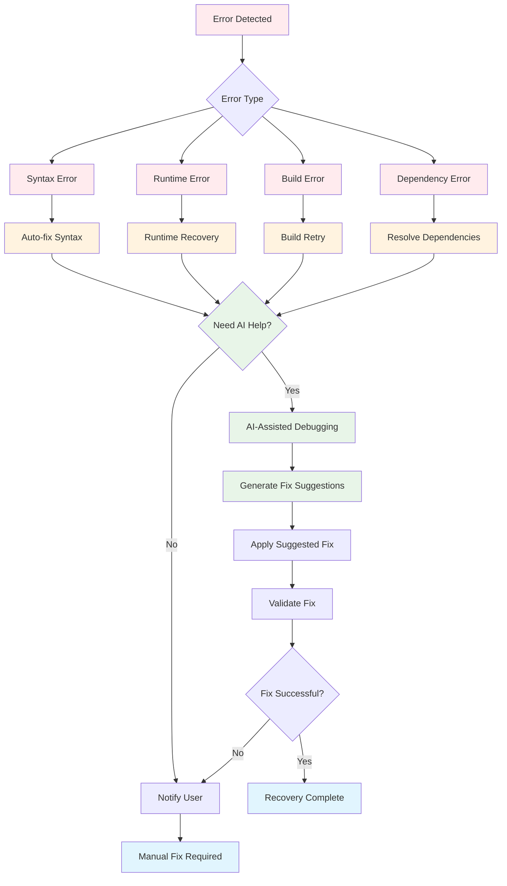

## Performance Optimization

### Development Performance

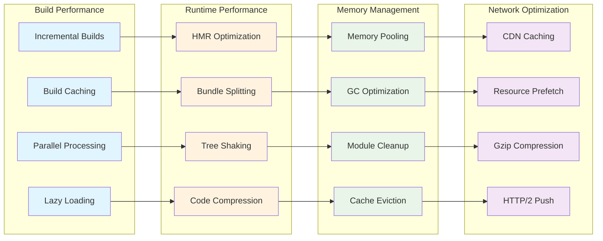

## Development Analytics

### Workflow Metrics

```mermaid
graph TB
    subgraph "Code Generation Metrics"
        GENERATION_TIME[Code Generation Time]
        CODE_QUALITY[Generated Code Quality]
        SUCCESS_RATE[Generation Success Rate]
        USER_SATISFACTION[User Satisfaction Score]
    end

    subgraph "Development Metrics"
        BUILD_TIME[Build Performance]
        HMR_SPEED[HMR Update Speed]
        ERROR_FREQUENCY[Error Frequency]
        RECOVERY_TIME[Error Recovery Time]
    end

    subgraph "User Experience Metrics"
        INTERACTION_TIME[User Interaction Time]
        TASK_COMPLETION[Task Completion Rate]
        FEATURE_USAGE[Feature Usage Analytics]
        FEEDBACK_SCORES[User Feedback Scores]
    end

    subgraph "System Performance"
        RESOURCE_USAGE[Resource Utilization]
        RESPONSE_TIME[System Response Time]
        THROUGHPUT[Request Throughput]
        AVAILABILITY[System Availability]
    end

    GENERATION_TIME --> DASHBOARD[Analytics Dashboard]
    CODE_QUALITY --> DASHBOARD
    SUCCESS_RATE --> DASHBOARD
    USER_SATISFACTION --> DASHBOARD

    BUILD_TIME --> DASHBOARD
    HMR_SPEED --> DASHBOARD
    ERROR_FREQUENCY --> DASHBOARD
    RECOVERY_TIME --> DASHBOARD

    INTERACTION_TIME --> DASHBOARD
    TASK_COMPLETION --> DASHBOARD
    FEATURE_USAGE --> DASHBOARD
    FEEDBACK_SCORES --> DASHBOARD

    RESOURCE_USAGE --> DASHBOARD
    RESPONSE_TIME --> DASHBOARD
    THROUGHPUT --> DASHBOARD
    AVAILABILITY --> DASHBOARD

    classDef codegen fill:#e8f5e8
    classDef development fill:#fff3e0
    classDef ux fill:#e1f5fe
    classDef system fill:#f3e5f5

    class GENERATION_TIME,CODE_QUALITY,SUCCESS_RATE,USER_SATISFACTION codegen
    class BUILD_TIME,HMR_SPEED,ERROR_FREQUENCY,RECOVERY_TIME development
    class INTERACTION_TIME,TASK_COMPLETION,FEATURE_USAGE,FEEDBACK_SCORES ux
    class RESOURCE_USAGE,RESPONSE_TIME,THROUGHPUT,AVAILABILITY system
```

This development workflow architecture enables seamless transformation from natural language to deployed applications while providing a rich, interactive development experience with real-time feedback and debugging capabilities.
