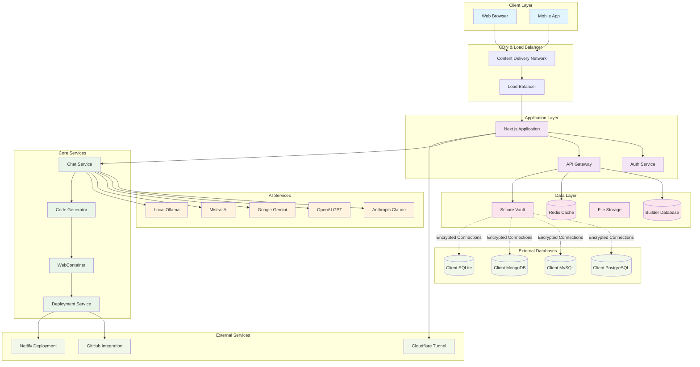
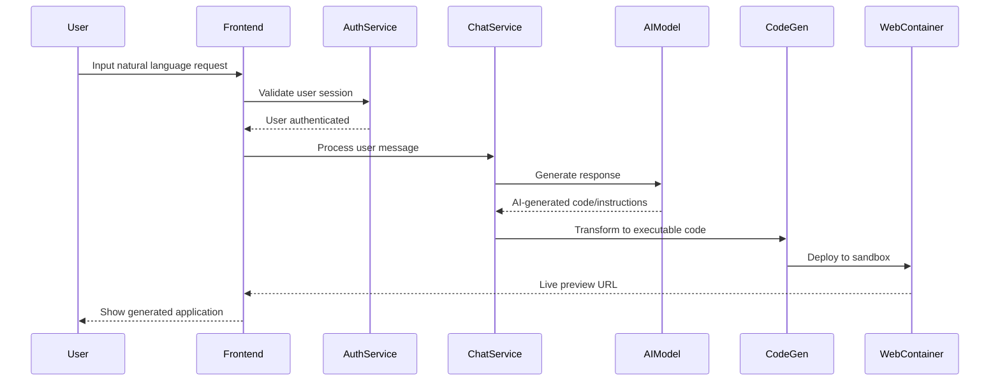
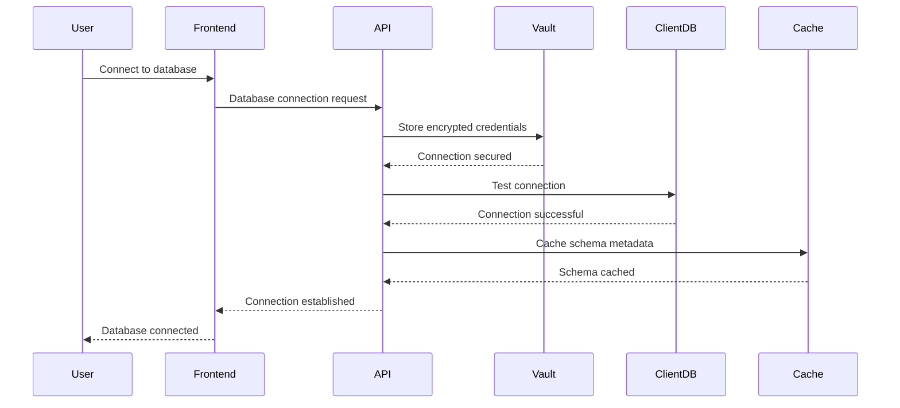

# System Architecture

## Overview

The liblab.ai platform is built on a modern, scalable architecture that combines AI-powered code generation with secure database connectivity and real-time development workflows. The system is designed as a multi-tenant, cloud-native application that can scale horizontally to support thousands of concurrent users.

## High-Level System Architecture

## Architecture Layers

### 1. Client Layer

The presentation layer where users interact with the platform:

- **Web Browser**: Primary interface using modern web technologies
- **Mobile App**: Progressive Web App (PWA) for mobile devices

### 2. CDN & Load Balancer

Infrastructure layer for performance and availability:

- **CDN**: Content delivery for static assets and caching
- **Load Balancer**: Distributes traffic across multiple application instances

### 3. Application Layer

Core application services:

- **Next.js Application**: Main application server with server-side rendering
- **Auth Service**: Authentication and authorization using better-auth
- **API Gateway**: Unified API layer for all client interactions

### 4. AI Services

AI model integrations for code generation:

- **Anthropic Claude**: Primary AI model for complex reasoning
- **OpenAI GPT**: Alternative AI model for code generation
- **Google Gemini**: Additional AI model option
- **Mistral AI**: Open-source AI model alternative
- **Local Ollama**: Self-hosted AI model support

### 5. Core Services

Business logic and application services:

- **Chat Service**: Manages conversations and AI interactions
- **Code Generator**: Transforms AI responses into executable code
- **WebContainer**: Sandboxed environment for code execution
- **Deployment Service**: Handles application deployment workflows

### 6. Data Layer

Persistent storage and caching:

- **Builder Database**: Application metadata and user data
- **Redis Cache**: High-performance caching layer
- **File Storage**: Generated code and assets
- **Secure Vault**: Encrypted storage for sensitive data

### 7. External Databases

User-connected databases:

- **PostgreSQL**: Relational database connections
- **MySQL**: Alternative relational database
- **MongoDB**: Document database support
- **SQLite**: Local database files

### 8. External Services

Third-party integrations:

- **GitHub**: Source code management and deployment
- **Netlify**: Automated deployment platform
- **Cloudflare Tunnel**: Secure tunneling for development

## Data Flow Patterns

### User Interaction Flow

### Database Connection Flow

## Scalability Patterns

### Horizontal Scaling

- **Application Layer**: Multiple Next.js instances behind load balancer
- **AI Services**: Request queuing and load distribution across providers
- **WebContainer**: Containerized execution environments
- **Database**: Connection pooling and read replicas

### Caching Strategy

- **Redis**: Application-level caching for session data and API responses
- **CDN**: Static asset caching at edge locations
- **Database**: Query result caching and schema metadata caching
- **Browser**: Client-side caching for improved user experience

## Security Architecture

### Authentication & Authorization

- **Multi-factor Authentication**: Email, OAuth providers
- **Role-based Access Control**: Granular permissions system
- **Session Management**: Secure session handling with JWT tokens
- **API Security**: Rate limiting and request validation

### Data Protection

- **Encryption at Rest**: All sensitive data encrypted in storage
- **Encryption in Transit**: TLS/SSL for all network communications
- **Secret Management**: Vault-based credential storage
- **Database Security**: Encrypted database connections

## Monitoring & Observability

### Application Monitoring

- **Performance Metrics**: Response times, throughput, error rates
- **User Analytics**: Usage patterns and feature adoption
- **AI Model Performance**: Token usage, response quality metrics
- **Database Performance**: Query performance and connection health

### Infrastructure Monitoring

- **Server Health**: CPU, memory, disk utilization
- **Network Performance**: Latency, bandwidth usage
- **Container Orchestration**: Docker container health and scaling
- **External Dependencies**: Third-party service availability

## Deployment Architecture

### Development Environment

- **Local Development**: Docker Compose with local services
- **Hot Reloading**: Real-time code updates during development
- **Testing Environment**: Isolated testing with mock services
- **Staging Environment**: Production-like environment for testing

### Production Environment

- **Container Orchestration**: Docker-based deployment
- **Load Balancing**: Multiple application instances
- **Database High Availability**: Master-slave replication
- **Backup & Recovery**: Automated backup strategies

## Technology Stack

### Frontend Technologies

- **Next.js 15**: React-based full-stack framework
- **TypeScript**: Type-safe development
- **Tailwind CSS**: Utility-first CSS framework
- **Radix UI**: Accessible component library

### Backend Technologies

- **Node.js**: Runtime environment
- **Prisma**: Database ORM and migrations
- **Better Auth**: Authentication system
- **WebContainer API**: Code execution sandbox

### Infrastructure

- **Docker**: Containerization platform
- **Redis**: In-memory data store
- **PostgreSQL**: Primary database
- **Cloudflare**: CDN and security services

This architecture provides a solid foundation for scalable, secure, and maintainable AI-powered application development platform.
